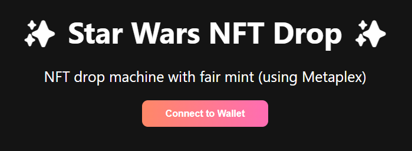
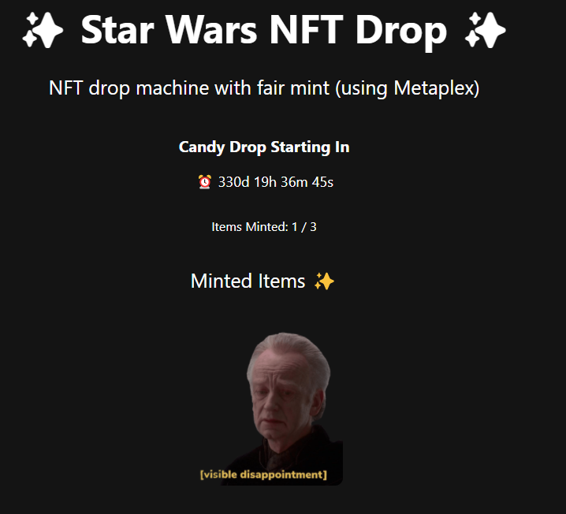
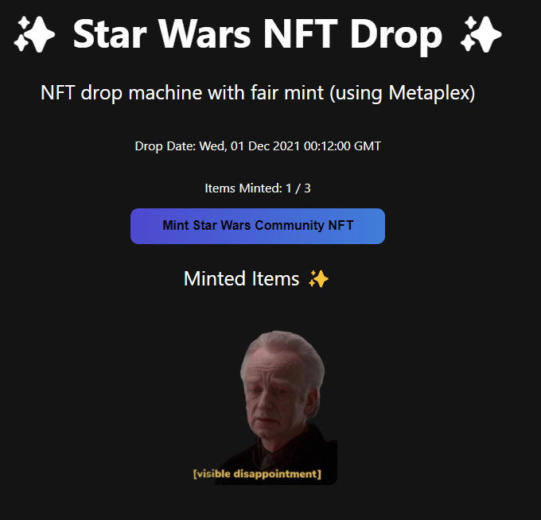
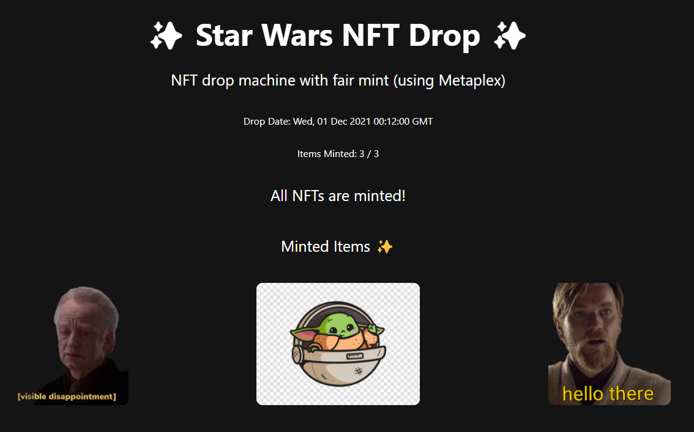
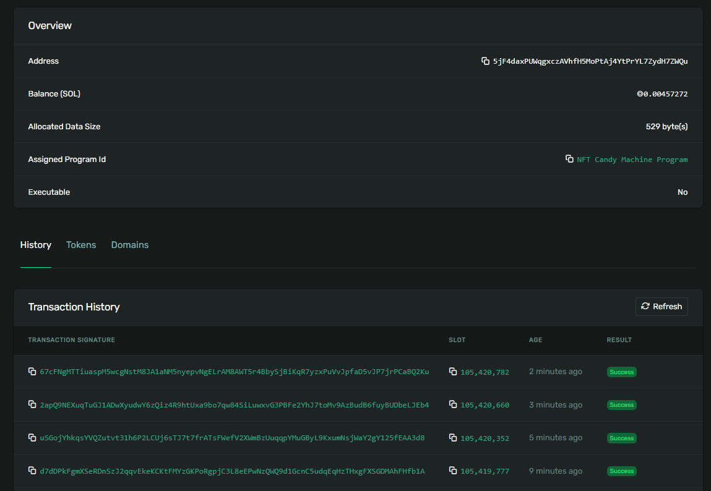

# Star Wars Solana NFT Drop Project

This project utilizes Metaplex's Candy Machine to create an NFT minter using Solana.
The app includes a drop timing where the NFTs can only be minted after a certain date.
The NFTs minted are simple Star Wars PNGs.

Solana Explorer of associated account/contract: [here](https://explorer.solana.com/address/5jF4daxPUWqgxczAVhfH5MoPtAj4YtPrYL7ZydH7ZWQu?cluster=devnet)

To run app, clone this repo and follow these commands:

1. cd into the `app` folder
2. Run `npm install` at the root of your directory
3. Run `npm run start` to start the project

Live Demo: https://star-wars-nft-drop-machine.vercel.app/

**Before connecting to wallet**

**After connecting wallet and before drop occurs (already minted 1)**

**Once drop is ready, can start minting NFTs**

**After minting all remaining NFTs**

**Transactions on Solana Explorer**

